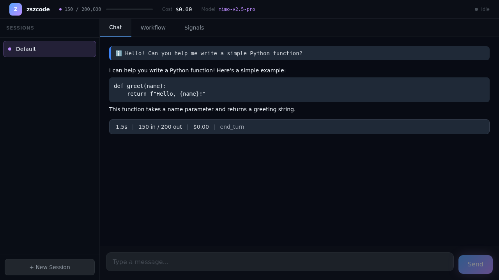

# zszcode

基于 Claude Code 源码的 fork，添加 Web UI 可观测性层。通过内嵌 HTTP/WebSocket 服务器，实时广播 agent loop 中的 API 调用、工具执行、权限确认等事件到浏览器端。




## 核心优势

### 🔍 实时可观测性
- **19 种事件类型**：从 API 调用到工具执行，全程可观测
- **实时 WebSocket 推送**：事件发生时立即推送到浏览器
- **历史回放**：支持查看最近 1000 条事件的历史记录

### 🌐 Web 控制台
- **Chat Tab**：实时显示用户消息和 AI 回复，包含代码块渲染
- **Workflow Tab**：可视化 agent 树和工具调用流程
- **Signals Tab**：详细的事件流，支持按类型过滤

### 🔐 安全认证
- **Token 认证**：每次启动生成随机 48 字符 token
- **WebSocket 认证**：实时连接也需要 token 验证
- **权限桥接**：Web UI 可远程确认工具权限请求

### ⚡ 独立二进制
- **单文件部署**：`bun build --compile` 生成独立可执行文件
- **无需 Node.js**：二进制内置运行时，可直接运行
- **跨平台**：支持 Linux、macOS、Windows

## 快速开始

### 方式一：npm 安装（推荐）

```bash
# 全局安装
npm install -g @zhe-sh-cn/zszcode

# 运行
zszcode

# 或者 npx 直接运行
npx @zhe-sh-cn/zszcode
```

### 方式二：bun 安装

```bash
# 全局安装
bun add -g @zhe-sh-cn/zszcode

# 运行
zszcode
```

### 方式三：从源码运行

```bash
# 克隆项目
git clone https://github.com/Zhe-SH-CN/zszcode.git
cd zszcode

# 安装依赖
bun install
cd web && bun install && cd ..

# 启动 CLI（自动启动 Web 服务器）
bun run src/entrypoints/cli.tsx

# 浏览器打开显示的 URL
# http://localhost:3000?token=xxx
```

### 方式四：下载二进制

```bash
# 从 GitHub Releases 下载
# https://github.com/Zhe-SH-CN/zszcode/releases

# Linux/macOS
chmod +x zszcode
./zszcode

# Windows
zszcode.exe
```

## 配置说明

### 配置文件位置

配置文件位于 `~/.zszcode/settings.json`，首次运行自动创建。

### 配置项

```json
{
  "model": "mimo-v2.5-pro",
  "baseUrl": "https://your-api-endpoint.com",
  "apiKey": "your-api-key-here",
  "webPort": 3000,
  "autoOpenBrowser": false,
  "permissionMode": "confirm"
}
```

| 字段 | 类型 | 默认值 | 说明 |
|------|------|--------|------|
| `model` | string | `mimo-v2.5-pro` | 默认使用的模型 |
| `baseUrl` | string | `''` | API 端点 URL（留空使用默认） |
| `apiKey` | string | `''` | API 认证密钥 |
| `webPort` | number | `3000` | Web 服务器端口 |
| `autoOpenBrowser` | boolean | `false` | 启动时自动打开浏览器 |
| `permissionMode` | `'auto' \| 'confirm'` | `'confirm'` | 权限确认模式 |

### 环境变量

也可以通过环境变量配置：

```bash
export ZSZ_MODEL="mimo-v2.5-pro"
export ZSZ_BASE_URL="https://your-api-endpoint.com"
export ZSZ_API_KEY="your-api-key"
export ZSZ_WEB_PORT=3000
```

## 架构概览

```
┌─────────────────────────────────────────────────────────────┐
│                      Web Browser                            │
│  ┌─────────┐  ┌──────────┐  ┌──────────┐  ┌─────────────┐ │
│  │  Chat   │  │ Workflow │  │ Signals  │  │ Permission  │ │
│  │   Tab   │  │   Tab    │  │   Tab    │  │    Bar      │ │
│  └────┬────┘  └────┬─────┘  └────┬─────┘  └──────┬──────┘ │
│       │            │             │                │        │
│       └────────────┴─────────────┴────────────────┘        │
│                          WebSocket                          │
└──────────────────────────┬──────────────────────────────────┘
                           │
┌──────────────────────────┴──────────────────────────────────┐
│                   Web Server (Bun.serve)                    │
│  ┌──────────────┐  ┌──────────────┐  ┌──────────────────┐ │
│  │  HTTP API    │  │   WebSocket  │  │  Static Files    │ │
│  │  /api/events │  │  /ws         │  │  /               │ │
│  └──────┬───────┘  └──────┬───────┘  └──────────────────┘ │
│         │                 │                                 │
│         └────────┬────────┘                                 │
│                  │                                          │
│           Event Bus (EventEmitter)                          │
└──────────────────┬──────────────────────────────────────────┘
                   │
┌──────────────────┴──────────────────────────────────────────┐
│                    CLI (Agent Loop)                         │
│  ┌──────────────┐  ┌──────────────┐  ┌──────────────────┐ │
│  │  Query Loop  │  │  Tool Exec   │  │  API Client      │ │
│  │              │  │              │  │  (Anthropic SDK)  │ │
│  └──────────────┘  └──────────────┘  └──────────────────┘ │
└─────────────────────────────────────────────────────────────┘
```

## 事件类型

### 核心事件

| 事件 | 触发时机 | 关键字段 |
|------|----------|----------|
| `turn_start` | Agent loop 开始迭代 | `turnNumber` |
| `turn_end` | Agent loop 结束迭代 | `turnNumber`, `duration`, `tokens` |
| `message` | 消息产出 | `role`, `content` |

### API 事件

| 事件 | 触发时机 | 关键字段 |
|------|----------|----------|
| `api_stream_start` | API 调用开始 | `model` |
| `api_stream_end` | API 调用结束 | `duration`, `tokens` |

### 工具事件

| 事件 | 触发时机 | 关键字段 |
|------|----------|----------|
| `tool_call_start` | 工具执行开始 | `toolName`, `toolUseId`, `input` |
| `tool_call_end` | 工具执行结束 | `toolName`, `success`, `duration` |

### Agent 事件

| 事件 | 触发时机 | 关键字段 |
|------|----------|----------|
| `agent_spawn` | 子 agent 启动 | `parentId`, `childId`, `agentType` |
| `agent_complete` | 子 agent 完成 | `agentId`, `duration` |

### 其他事件

| 事件 | 触发时机 | 关键字段 |
|------|----------|----------|
| `tool_permission_request` | 权限请求 | `toolName`, `toolUseId` |
| `tool_permission_resolved` | 权限确认 | `toolUseId`, `decision`, `source` |
| `mcp_connect` | MCP 服务器连接 | `serverName`, `success` |
| `mcp_call` | MCP 工具调用 | `serverName`, `toolName`, `duration` |
| `state_change` | 状态变更 | `field`, `oldValue`, `newValue` |
| `hook_fire` | Hook 触发 | `hookName` |
| `skill_load` | 技能加载 | `name`, `source` |
| `skill_invoke` | 技能调用 | `name` |
| `context_compact` | 上下文压缩 | - |

## Web UI 功能

### Chat Tab
- 实时显示用户消息和 AI 回复
- 支持代码块语法高亮
- 自动滚动到最新消息
- 显示 token 使用量和成本

### Workflow Tab
- 可视化 agent 树结构
- 显示工具调用流程
- 支持展开/折叠查看详情
- 颜色编码表示状态（运行中/完成/失败）

### Signals Tab
- 详细的事件流
- 支持按事件类型过滤
- 实时更新
- 暂停/恢复功能

## 开发指南

### 项目结构

```
zszcode/
├── src/
│   ├── zszcode/           # zszcode 核心模块
│   │   ├── config.ts      # 配置管理
│   │   ├── events.ts      # 事件总线
│   │   └── server.ts      # Web 服务器
│   ├── entrypoints/       # CLI 入口
│   ├── services/          # 服务层
│   │   ├── api/           # API 客户端
│   │   ├── tools/         # 工具执行
│   │   └── mcp/           # MCP 连接
│   └── query.ts           # Agent loop
├── web/                   # React 前端
│   ├── src/
│   │   ├── App.tsx        # 主布局
│   │   ├── components/    # UI 组件
│   │   └── hooks/         # React hooks
│   └── dist/              # 构建输出
├── tests/                 # 测试文件
└── docs/plans/            # TDD 任务计划
```

### 运行测试

```bash
# 运行全部测试
bun test

# 运行特定模块测试
bun test tests/01-task-*.test.ts

# 浏览器验证
bun run tests/test-web-ui.ts
bun run tests/test-workflow.ts
```

### 构建

```bash
# 构建前端
cd web && bun run build

# 编译二进制
bun build --compile src/entrypoints/cli.tsx --outfile zszcode

# 类型检查
bunx tsc --noEmit
```

## 技术栈

- **后端**：Bun + TypeScript
- **前端**：React + TypeScript + Tailwind CSS
- **实时通信**：WebSocket
- **构建工具**：Vite
- **测试框架**：Bun Test + Playwright

## 许可证

本项目基于 Claude Code 源码 fork，仅用于个人研究和学习目的。

## 致谢

- [Claude Code](https://github.com/anthropics/claude-code) - 原始项目
- [Bun](https://bun.sh/) - JavaScript 运行时
- [React](https://react.dev/) - UI 框架
- [Tailwind CSS](https://tailwindcss.com/) - 样式框架
